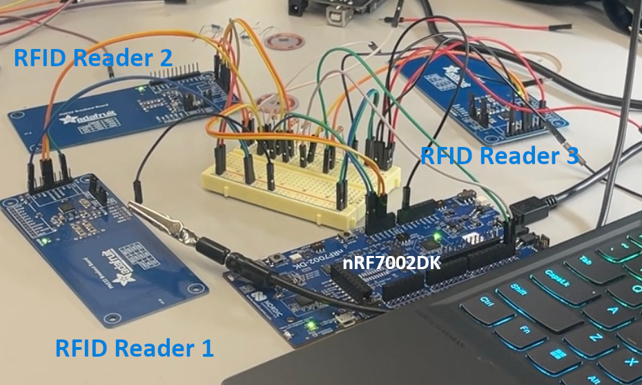
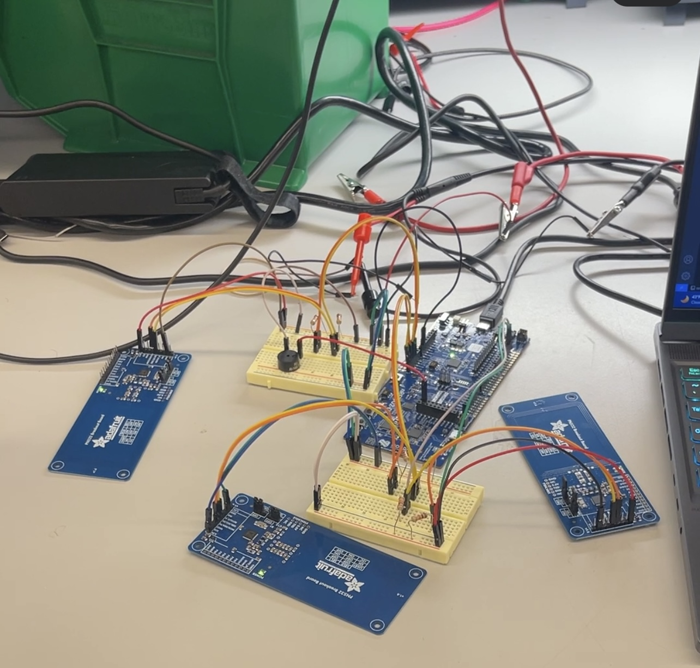
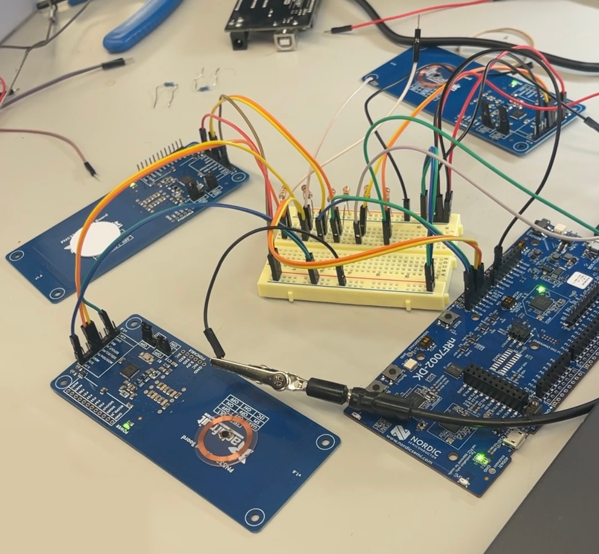
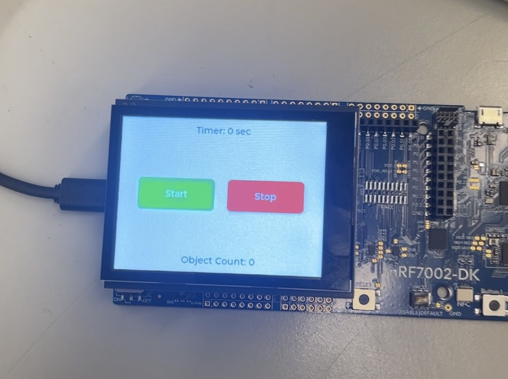
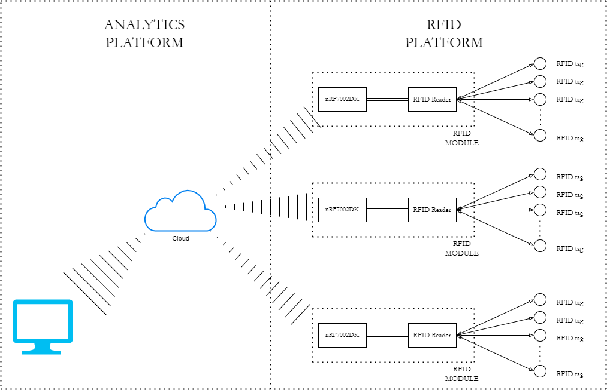
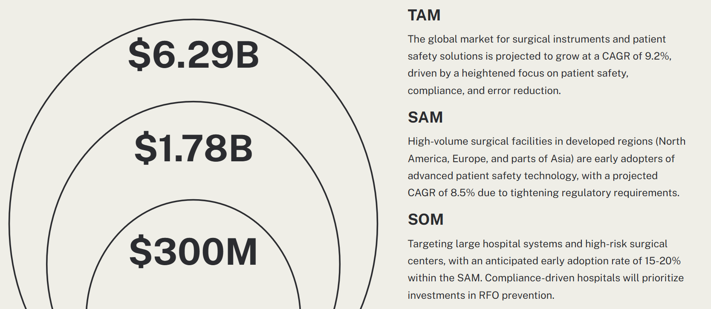
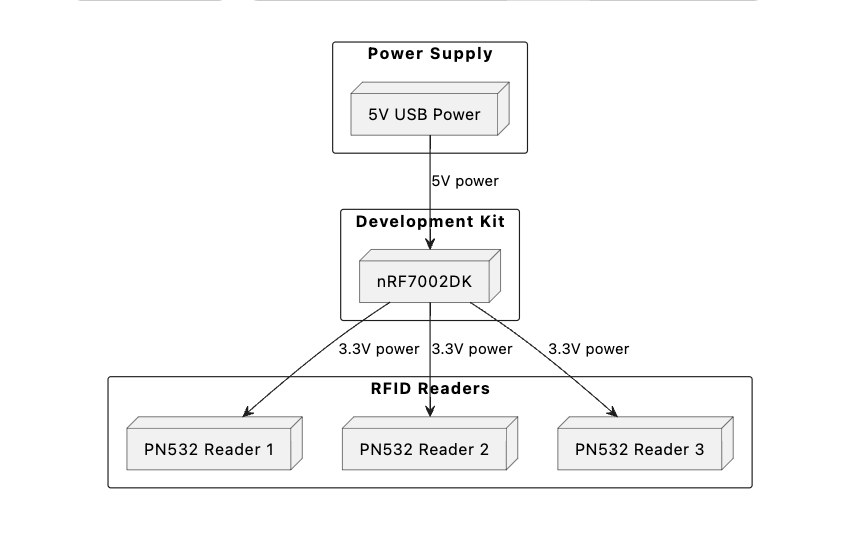
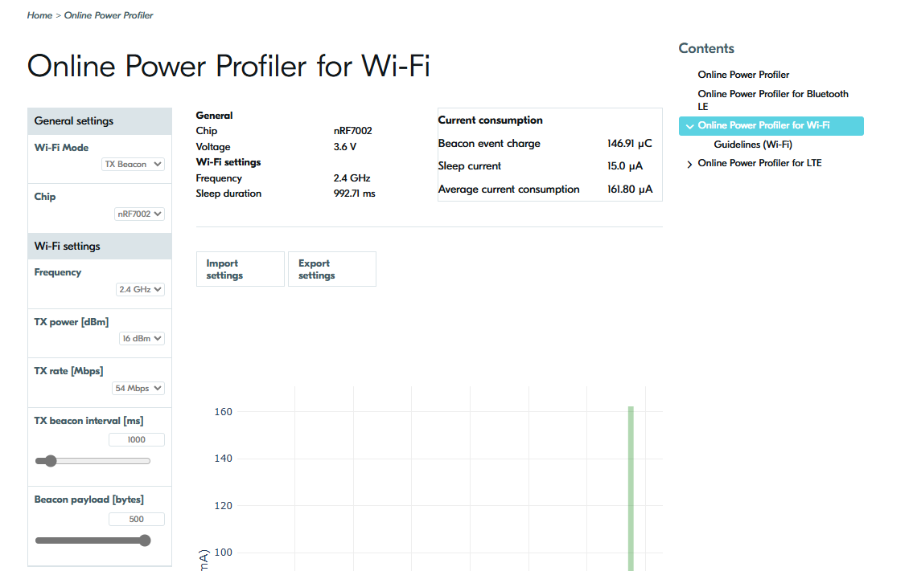

# SafeScan

## Team details

Team members: Vishnu Venkatesh, Nami Lindquist, Yadnik Bendale

[Code Archive](https://github.com/vishnuv4/SafeScan/)

[Website GitHub Repo](https://github.com/ese5180/fp-f24-report-website-t04-safescan)

## Project

Our IoT venture pitch was a product designed for hospitals, specifically surgery rooms, to detect and thereby reduce Retained Foreign Objects (RFOs). RFOs are medical instruments and equipment left behind in a patient after surgery, and can lead to severe consequences. Statistics reveal that an estimated 1,500 RFO cases occur annually in the US alone - this is exacerbated by the high-pressure environment of a surgery room, miscommunication, complexity of the surgery, and other factors that are a fixture of surgery rooms. Each RFO incident costs hospitals significant amounts in terms of medical expenses, legal liabilities, and reputational damage.

Our product is an RFID based system that is proposed to integrate seamlessly with most surgical workflows to keep track of all the medical instruments, and inform the surgery team if anything is unaccounted for. We intended to prototype a system of RFID readers and tagged medical instruments to keep track of the various categories of equipment that are used in a surgery room.

## Demo videos

| [MQTT Communication](https://drive.google.com/file/d/1gvAYI0iwCdIEnrwGUyyBEJspVwzbkBlP/view?usp=drive_link) | [RFID Reader and button](https://drive.google.com/file/d/1-VaSbkqoter-aPsLHdEuI1GIpoYi5z5y/view?usp=drive_link) | [Touch Screen](https://drive.google.com/file/d/1LX_aAUIAQsWCOFPT2VRMtihTBBeW2Vw_/view?usp=drive_link) |

## Images

**An nRF7002DK connected to 3 RFID readers (2 images)**

**An nRF7002DK connected to 3 RFID readers with tags**

**The touchscreen interface**

**MQTT dashboard indicating which tags are connected**

  
  

## System Architecture

These RFID readers are intended to be placed under bins and trays that the hospital would already be using, and keep a record of the items present at the start of the surgery. When the surgery is over, if all the items have not been accounted for then the surgery team is alerted.

This can also function as a logistics management system, if scaled up - if we keep tabs on all the items that are connected to the RFID readers at any given instant, we can examine the patterns of disconnection and reconnection and understand the flow of equipment and materials, and possibly reduce bottlenecks and inefficiencies.

## Target Market and Demographics

The following graphic shows the estimated Total Addressable Market (TAM), Serviceable Addressable Market (SAM), and Serviceable Obtainable Market (SOM).

We expect to make the sales primarily to hospital administrators, and those managing logistics for large hospitals.

## Security, Hardware, and Software requirements

# RFID System for Surgical Instrument Tracking

## Security Requirements

- **SEC01**: The RFID tag information shall be immutable once programmed.
  - **Verification**: Ensured that the UID of the RFID tags could not be altered once set.

- **SEC02**: The nRF7002DK shall authenticate only one RFID reader.
  - **Verification**: Configured the Device Tree to only recognize the I2C address 0x24, ensuring exclusive communication with a designated RFID reader.

- **SEC03**: The authentication shall run on ARM TrustZone.
  - **Verification**: Utilized ARM TrustZone to provide a secure environment for authentication processes, ensuring sensitive operations are protected.

- **SEC04**: WiFi communication shall happen through certificate authentication.
  - **Verification**: Implemented MQTT over TLS using X.509 client certificates, ensuring encrypted and authenticated communication with the MQTT broker.

- **SEC05**: The nRF7002 shall disallow programming firmware from an untrusted in-circuit emulator (ICE).
  - **Verification**: Restricted firmware programming to authenticated tools only, securing against unauthorized access and modifications.

## Hardware Requirements

- **HRS01**: Each RFID reader shall be able to detect RFID tags within 5cm.
  - **Verification**: Achieved detection within the specified range during testing.

- **HRS02**: Each RFID reader shall be able to detect at least 5 tags.
  - **Verification**: Limited to detecting 2 tags simultaneously due to hardware constraints of the PN532 chip.

- **HRS03**: The RFID tags shall use the 13.56MHz communication band.
  - **Verification**: Confirmed compatibility of tags and readers operating at 13.56MHz.

- **HRS04**: The RFID reader shall communicate with the Nordic nRF7002DK development kit.
  - **Verification**: Successfully connected multiple RFID readers to a single nRF7002DK via distinct I2C buses.

- **HRS05**: Each nRF7002DK shall be able to communicate wirelessly over WiFi to a dashboard.
  - **Verification**: Demonstrated effective WiFi communication using MQTT over TLS.

- **HRS06**: At least two nRF700DK development kits must be able to communicate wirelessly at the same time.
  - **Verification**: Tested with a single kit; scalability to multiple kits remains proven.

- **HRS07**: The RFID platform shall use OTS components for the MVP.
  - **Verification**: Utilized off-the-shelf PN532 RFID readers and MIFARE classic tags.

## Software Requirements

- **SRS01**: Each nRF7002DK shall be uniquely identifiable in the analytics platform.
  - **Verification**: Configured to identify each nRF7002DK by the UID of connected tags.

- **SRS02**: The nRF7002DK shall periodically transmit the list of currently connected RFID tags over WiFi.
  - **Verification**: Successfully implemented periodic data transmission, visible in the PyQt GUI.

- **SRS03**: The nRF7002DK shall use Zephyr RTOS.
  - **Implementation & Verification**: Employed Zephyr RTOS, leveraging its features for MQTT, I2C, and logging to enhance system functionality.

- **SRS04**: The nRF7002DK shall use the Memfault Device Reliability platform.
  - **Verification**: Integrated Memfault to monitor system stability and facilitate issue diagnosis through core dumps and telemetry.

- **SRS05**: The analytics platform shall be able to receive data from each nRF7002DK.
  - **Verification**: The PyQt Python-based platform received data every 5 seconds over MQTT WiFi, confirming real-time communication.

- **SRS06**: The analytics platform shall not place any constraints on the number of RFID modules it can support.
  - **Verification**: The system architecture and Python GUI were designed to parse UIDs without limiting the number of RFID modules that can be monitored.

- **SRS07**: The analytics platform backend shall be able to receive the data coming in from the RFID platform into a codebase.
  - **Verification**: Data was not only displayed in real-time on the terminal but also stored in CSV format for further analysis.

## Product Function and Components

The key functions of this project are: 
1) Touch screen with start and stop buttons to start and stop counting surgical objects. Displayed a timer that represented how much time has passed since the start of the counting session. Displayed object count. 
2) Implemented MQTT communication for displaying the status of objects (whether accounted for or not) and their respective scan timestamps using a custom PyQt Python GUI interface.
3) The interface kept count of RFID tags in a timestamped manner and had a provision to save the detials of the tages used in the suregery in CSV format. 
4) RFID readers can read one RFID tag each. We supported up to three RFID readers at a time.
5) When user tries to end surgery without all objects being accounted for, a buzzer will sound until all objects are accounted for.

## Power & Cost Budgeting

### Power

Below is the power budget diagram which outlines the distribution and consumption of power across our hardware components:

The nRF7002DK will remain in sleep mode for most of its life, only needing to wake up every second to send an event. Entering those details into the online power profiler, we see a very low power consumption:

We can assume a worst case power draw of 1mA, so at 3.6V that will come out to 3.6mW.

The PN532s consume 150mA during operation. Using that value as current consumption, we can compute the maximum upper threshold on current consumption - in reality it will be significantly lesser than that with some clever circuitry, perhaps using a transistor connected to a GPIO to turn the PN532s on only when a sample should be made - but calculating the absolute worst case sets a hard limit on the current.

3 * 150mA = 450mA \
450mA * 3.3V = 1.485W

Therefore the total power consumption of the system will come out to be approximately 1.5W.

### Cost

The costs are listed below:
- Adafruit 2.8" TFT Touch Shield for Arduino with Resistive Touch Screen v2 - STEMMA QT / Qwiic ($30)
- Nordic Semiconductor NRF7002-DK WiFi Development Tools ($60)
- Adafruit 13.56MHz RFID/NFC tag assortment - Classic 1K ($10)
- Adafruit PN532 NFC/RFID controller breakout board - v1.6 ($40)

Total cost: $130

# Parts of the project that were a success

- Touch screen was easy to implement with the LVGL library 
- We were able to get 3 I2C buses working, and understood how to use devicetree to set it up.
- The RFID readers on those I2C buses also worked, and we were able to read RFID tags on each. 
- The MQTT part was a success, we were able to use Nordic's MQTT libraries in the code to send messages to a local MQTT client.

# Parts of the project that didn't go well

- We wanted to use AWS to implement inventory management and analytics with our product, but had a lot of difficulty doing this because our dev board is not supported by AWS.
- We weren't able to get SPI working on the nRF7002DK, and spent quite a bit of time on that before decidiing to use 3 I2C buses - lost a bit of time there.
- Because of time constraints, we weren't able to integrate all of our functionality. We got the screen and the RFID readers working separately but didn't have the time to integrate those.

# What we would do differently

- Time management was the biggest barrier in this. We should ideally have time boxed the efforts we spent on getting SPI to work before deciding to switch to I2C, and the efforts we spent trying to get AWS working before switching to another MQTT broker.

# Would we change the system design

- Yes, we can use higher quality parts that would (a) handle more RFID tags, (b) be more efficient with current consumption. However, that would require a higher budget so probably is not necessary for an MVP/pitch prototype.
